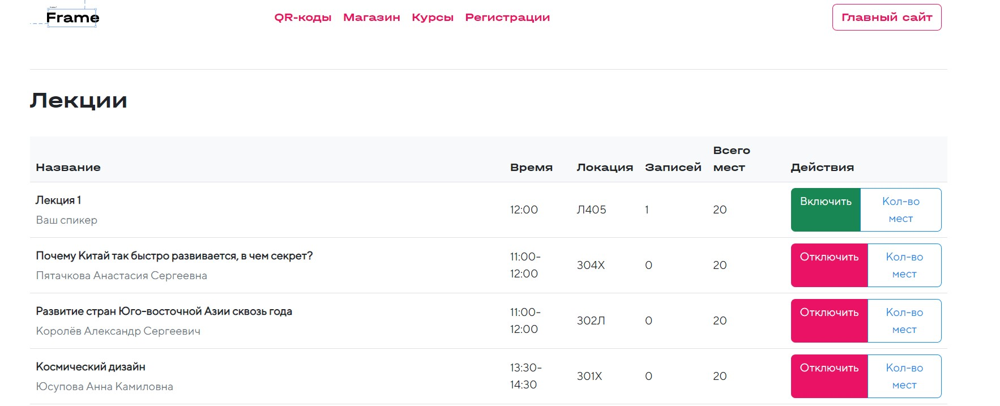
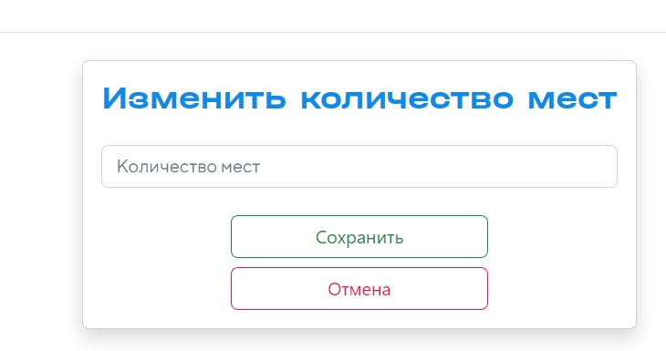
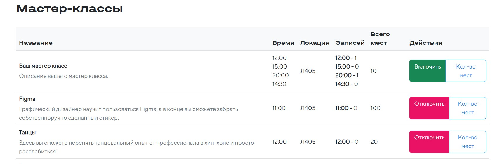
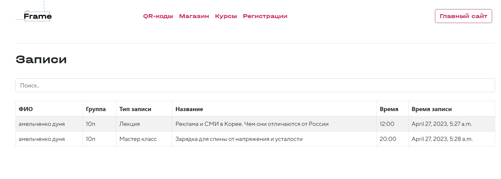

## Инструкция по работе с лекциями/мастер-классами для администратора

1. После открытия [Админ панели](https://framelyc.ru/admin_codes) откройте страницу [Курсы](https://framelyc.ru/admin_courses)

2. На странице представлены два блока(лекции и мастер-классы)
    

3. Нажмите Включить/Отключить, чтобы изменить видимость курса(Если включен пользователь видит курс и может зарегистрироваться Если выключен пользователь не имеет доступ к курсу)

4. Нажмите Кол-во мест, чтобы изменить максимальное количество мест на курс
    

5. Введите новое количество мест
6. Нажмите сохранить

 

* В блоке с Мастер-классами в поле Записи отображается количество занятых мест на каждый слот
    

* Перейдите на страницу [Регистрации](https://framelyc.ru/admin_registrations) для просмотра информации о записях
    
