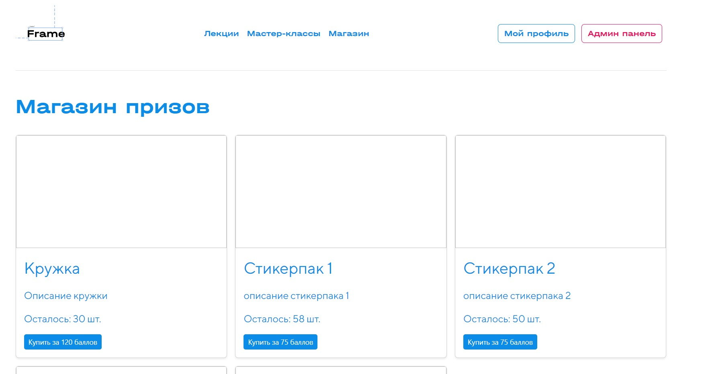

## Работа с магазином для пользователя

1. Пользователь можно приобрести товар. Для этого необходимо открыть [магазин](https://framelyc.ru/shop/)
    

2. Нажмите Купить за `n` баллов для покупки товара
3. Если у пользователя недостаточно средств, то он получает уведомление об ошибки. Также, если во время покупки товар закончился, пользователь получает страницу с ошибкой. В иных случаях Успех
4. [В личном кабинете](https://framelyc.ru/profile) появился блок с призами
    

5. Нажмите Показать Код, чтобы получить информацию о товаре.
    

 

## Работа с магазином для администратора

1. После открытия [Админ панели](https://framelyc.ru/admin_codes) откройте страницу [Магазин](https://framelyc.ru/admin_shop)

2. Вы можете изменять статус видимости товара, нажимая Включить/Отключить
    

3. В блоке Покупки вам доступны все покупки пользователей. 
    
4. Нажмитие Отдать товар, чтобы отметить товар как полученный пользователем. 

